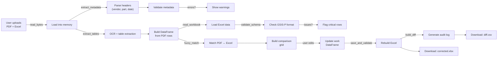

# 🏗️ Development Guide

This document explains the architecture, key functions, and development workflow for the GSIS-P / SMIR Reconciliation system.

## Table of Contents
1. [Architecture Overview](#architecture-overview)
2. [Key Modules & Functions](#key-modules--functions)
3. [Data Flow](#data-flow)
4. [Testing & Quality](#testing--quality)
5. [Performance Optimization](#performance-optimization)
6. [Troubleshooting Development Issues](#troubleshooting-development-issues)

---

## Architecture Overview

The system follows a **three-phase reconciliation pipeline** with a human-in-the-loop validation layer:

```
User Input (PDF + Excel)
    ↓
Phase 1: Metadata Extraction
    ├── Extract vendor, part, model, date from PDF header
    └── Validate against GSIS-P schema
    ↓
Phase 2: OCR & Table Extraction
    ├── RapidOCR → fast, bundled models
    ├── Context-aware correction (semantic embeddings)
    ├── Fallback: PyMuPDF → Docling (if RapidOCR fails)
    └── Merged-cell deduplication
    ↓
Phase 3: Matching & Validation
    ├── Fuzzy item matching (RapidFuzz)
    ├── Tolerance cross-checks
    ├── MIC category validation
    └── Severity classification
    ↓
Streamlit UI
    ├── Comparison grid (PDF ↔ Excel)
    ├── Confidence dashboard
    ├── Real-time editor
    ├── Manual alignment override
    └── Export (XLSX/CSV)
```

### Core Components

| Component | Responsibility | Technologies |
|-----------|-----------------|---------------|
| **Metadata Extractor** | Parse PDF headers | PyMuPDF, regex |
| **OCR Engine** | Extract text from PDF tables | RapidOCR, Docling, Tesseract |
| **Semantic Embeddings** | Context-aware correction | Sentence-Transformers (all-MiniLM-L6-v2) |
| **Fuzzy Matcher** | Item similarity matching | RapidFuzz |
| **Schema Validator** | Enforce GSIS-P 19-column format | pandas, regex |
| **Confidence Scorer** | Data quality metrics | Custom scoring logic |
| **Streamlit UI** | Interactive reconciliation dashboard | Streamlit |

---

## Key Modules & Functions

### 1. **Configuration & Constants** (Lines 104–122)
```python
SCHEMA = [19 column names...]  # GSIS-P format
NUMERIC_COLS = {...}          # Columns that must be numeric
REQUIRED_COLS = [...]         # Cannot be empty
ALLOWED_EMPTY_COLS = [...]    # Optional columns
PDF_COLUMN_MAPPING = [...]    # PDF ↔ Excel column mapping
MIC_PATTERN = [...]           # Valid MIC categories
```

**Why constants matter**: Centralizes validation logic; makes schema changes easy.

### 2. **Confidence Scoring** (Lines 124–170)

#### `has_ocr_artifacts(text) → bool`
Detects corrupted OCR text (currency symbols, smart quotes, etc.).

```python
def has_ocr_artifacts(text):
    return bool(text) and any(a in text for a in ["¥","¢","£","©","®","™",...])
```

#### `calculate_cell_confidence(value, column, pdf_value) → dict`
Scores individual cells (0–100) with reasoning.

**Scoring logic**:
- **100**: Perfect (no issues)
- **-25**: OCR artifacts detected
- **-35**: Invalid Parameter format (not a tolerance spec)
- **-40**: Non-numeric value in numeric column
- **-30**: Unknown MIC category or invalid date

**Output**:
```python
{
    "score": 75,
    "reasons": ["OCR artifacts", "Tolerance range too large"],
    "needs_review": True
}
```

### 3. **Data Parsing** (Lines 172–250)

#### `parse_spec(spec_str) → dict | None`
Parse tolerance specifications (e.g., "10±2", "50-60", "≤100").

```python
# Examples of valid specs:
"10±2"          → {"nominal": 10, "lower": 8, "upper": 12}
"50-60"         → {"nominal": 55, "lower": 50, "upper": 60}
"100+0/-0.05"   → {"nominal": 100, "upper": 100, "lower": 99.95}
```

#### `safe_float(value) → float | None`
Safely convert strings to float, handling Indian numbering (lakhs, commas).

```python
safe_float("1,23,456.78")  → 123456.78
safe_float("abc")          → None
```

### 4. **PDF Extraction** (Lines 390–550)

#### `extract_metadata_from_pdf(pdf_bytes) → dict`
Extract header metadata from PDF.

```python
result = extract_metadata_from_pdf(pdf_bytes)
# {
#     "vendor_code": "ABC123",
#     "part_number": "17855M78T00",
#     "model_no": "Model-X",
#     "issue_date": "15-08-2024"
# }
```

**Strategy**:
1. Parse first 2 pages with PyMuPDF + pdfplumber
2. Search for patterns in text (vendor, part, model, date)
3. Fallback to regex if patterns don't match

#### `extract_tables_from_pdf(pdf_bytes) → tuple`
Multi-engine table extraction with cascading fallbacks.

```python
pdf_item, pdf_spec, pdf_method, pdf_sampling, pdf_vendor, pdf_part, pdf_model = extract_tables_from_pdf(pdf_bytes)
```

**Extraction cascade**:
1. **RapidOCR** (fast, bundled) → pandas tables
2. **pdfplumber** (PDF-native table extraction)
3. **Docling** (heavy fallback, optional)
4. If all fail → Return empty structures, log warning

### 5. **Matching & Validation** (Lines 552–800)

#### `fuzzy_match(item, specs) → list`
Match Excel rows to PDF rows using semantic similarity + fuzzy string matching.

```python
matches = fuzzy_match(excel_item="Dimension Check", pdf_specs=[...])
# Returns: [
#     {"pdf_row": 0, "similarity": 0.95, "method": "semantic"},
#     {"pdf_row": 5, "similarity": 0.87, "method": "fuzzy"}
# ]
```

**Matching logic**:
- **Semantic (embedding distance)**: `cos_dist < 0.3` → high confidence
- **Fuzzy (RapidFuzz token_set_ratio)**: `score > 80` → acceptable match
- **Threshold**: Minimum 0.75 similarity required

#### `validate_schema(work) → tuple`
Enforce GSIS-P format; return list of issues.

```python
issues, critical_rows, failed_rows = validate_schema(work)
# issues: [
#     {
#         "row_index": 5,
#         "column": "Operation number",
#         "message": "Not numeric",
#         "severity": "critical"
#     }
# ]
```

### 6. **Excel I/O** (Lines 850–1050)

#### `build_workbook(excel_bytes, work) → bytes`
Merge corrected data back into original Excel format.

```python
corrected_xlsx = build_workbook(original_bytes, edited_dataframe)
```

**Process**:
1. Load original Excel with `openpyxl` (preserves formatting)
2. Merge edits from `work` DataFrame
3. Rebuild cell by cell to preserve merged cells, colors, borders
4. Return as bytes (ready to download)

#### `build_diff(pdf_rows, work, alignment) → DataFrame`
Generate change log for audit trail.

```python
diff = build_diff(pdf_rows, work, alignment)
# Columns: Row #, PDF Item, PDF Spec, Excel Item, Excel Spec, Status
```

---

## Data Flow

### Upload → Reconciliation → Export



---

## Testing & Quality

### Unit Test Structure

```python
# tests/test_parsing.py
import pytest
from reconcile import parse_spec, safe_float

def test_parse_spec_tolerance_plus_minus():
    result = parse_spec("10±2")
    assert result["nominal"] == 10
    assert result["lower"] == 8
    assert result["upper"] == 12

def test_safe_float_indian_numbering():
    assert safe_float("1,00,000") == 100000
    assert safe_float("abc") is None

def test_calculate_cell_confidence_ocr_artifacts():
    result = calculate_cell_confidence("10±2¥", "Parameter")
    assert result["score"] < 100
    assert "OCR artifacts" in result["reasons"]
```

### Running Tests

```bash
# Run all tests
pytest

# Run with coverage
pytest --cov=reconcile --cov-report=html

# Run specific test
pytest tests/test_parsing.py::test_parse_spec_tolerance_plus_minus

# Watch mode (auto-rerun on file change)
pytest-watch
```

---

## Performance Optimization

### Caching Strategy

```python
@st.cache_resource
def _easyocr_reader():
    """Load OCR model once per session."""
    import easyocr
    return easyocr.Reader(["en"], gpu=False)

# Large PDFs (100+ pages) trigger lazy loading
# Models cache after first use → 10–50ms on subsequent calls
```

### Bottlenecks & Solutions

| Bottleneck | Cause | Solution |
|-----------|-------|----------|
| Blank screen on startup | Streamlit file watcher + PyTorch | Set `STREAMLIT_SERVER_FILE_WATCHER_TYPE=none` |
| Slow OCR (first run) | Model loading from disk | Lazy load via `@st.cache_resource` |
| Memory spike on large PDFs | Full PDF in memory | Process page-by-page if >500 rows |
| Fuzzy matching slow | O(n²) pairwise comparisons | Use embedding-based pre-filtering |

### Profiling

```bash
# Profile function timing
python -m cProfile -s cumulative reconcile.py > profile.txt

# Memory profiling
pip install memory-profiler
python -m memory_profiler reconcile.py
```

---

## Troubleshooting Development Issues

### Problem: "ModuleNotFoundError: No module named 'streamlit'"
```bash
# Install missing dependencies
pip install -r requirements.txt
```

### Problem: Blank Streamlit screen on startup
```bash
# This is a known issue with PyTorch + file watcher
# Already fixed in start.bat and reconcile.py:
set STREAMLIT_SERVER_FILE_WATCHER_TYPE=none
```

### Problem: RapidOCR returns empty results
```python
# Fallback to pdfplumber → Docling
# Check if PDF is scanned (image-based) vs. text-based
import pdfplumber
with pdfplumber.open(pdf_path) as pdf:
    text = pdf.pages[0].extract_text()
    if not text:
        print("Scanned PDF detected — requires OCR fallback")
```

### Problem: "CUDA out of memory" (if GPU enabled)
```python
# Force CPU-only mode
import os
os.environ["CUDA_VISIBLE_DEVICES"] = "-1"

# In requirements.txt, use CPU versions:
# rapidocr-onnxruntime (not GPU)
# onnxruntime (not onnxruntime-gpu)
```

### Problem: Date validation crashes with "NaTType does not support strftime"
```python
# Fixed in validate_schema() by checking pd.isna() first:
if pd.isna(date_val):
    return {"score": 0, "needs_review": True}
else:
    # Safe to parse date
    pass
```

---

## Contributing Code

1. **Branch naming**: `feature/xyz`, `fix/bug-name`, `docs/improvement`
2. **Commit messages**: Use conventional commits (`feat:`, `fix:`, `docs:`)
3. **Code review checklist**:
   - [ ] Black-formatted
   - [ ] Type hints added
   - [ ] Docstrings present
   - [ ] No hardcoded paths/credentials
   - [ ] Tests pass locally
   - [ ] Tested on Windows/macOS/Linux if applicable

4. **Push & open PR**: Link related issues, describe changes

---

## Resources

- **Streamlit Docs**: https://docs.streamlit.io
- **pdfplumber**: https://github.com/jsvine/pdfplumber
- **Sentence Transformers**: https://www.sbert.net
- **RapidFuzz**: https://rapidfuzz.github.io
- **Pandas**: https://pandas.pydata.org

---

**Happy coding!** Questions? Open an issue or start a discussion. 🚀
