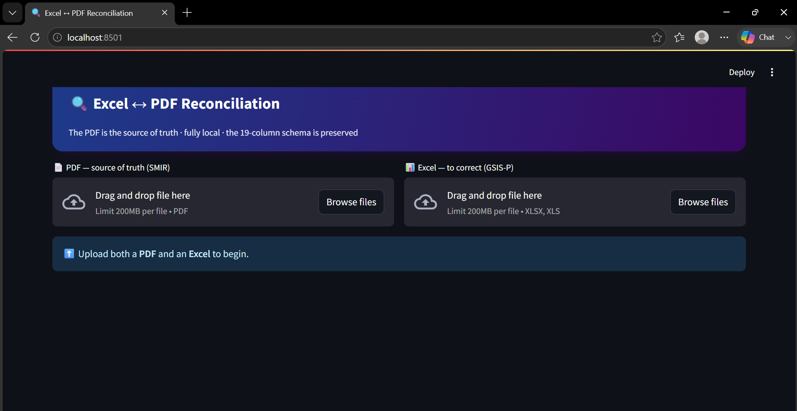
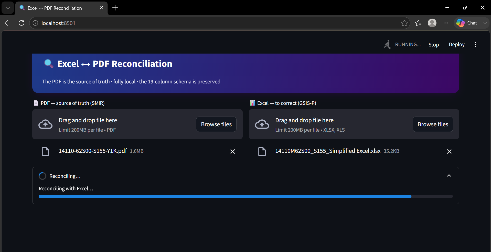
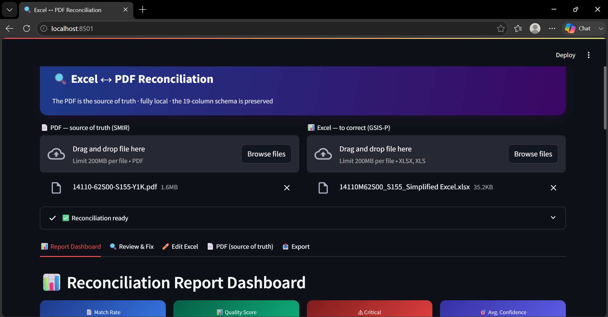
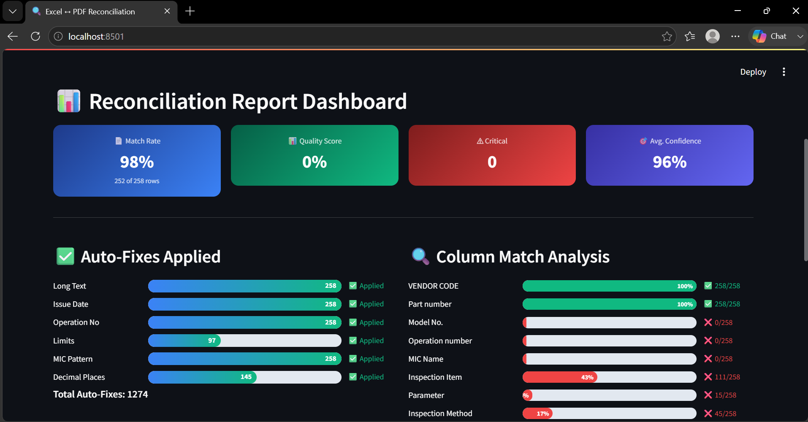
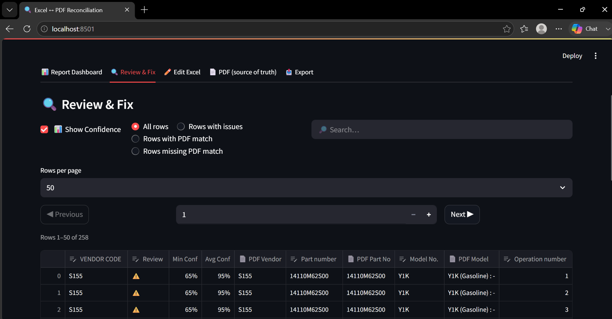
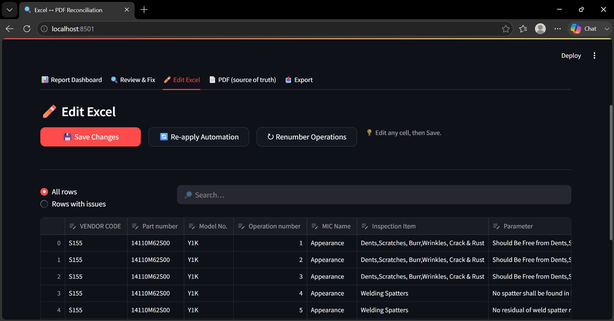
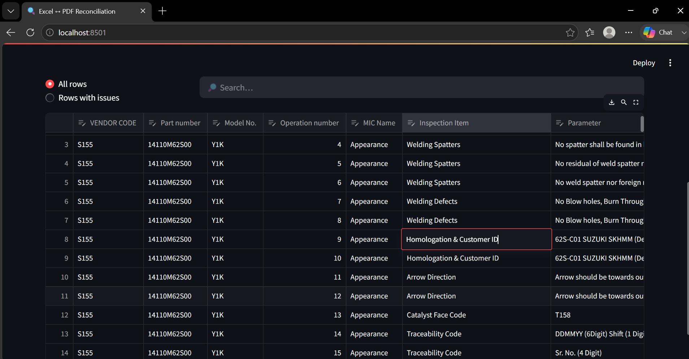
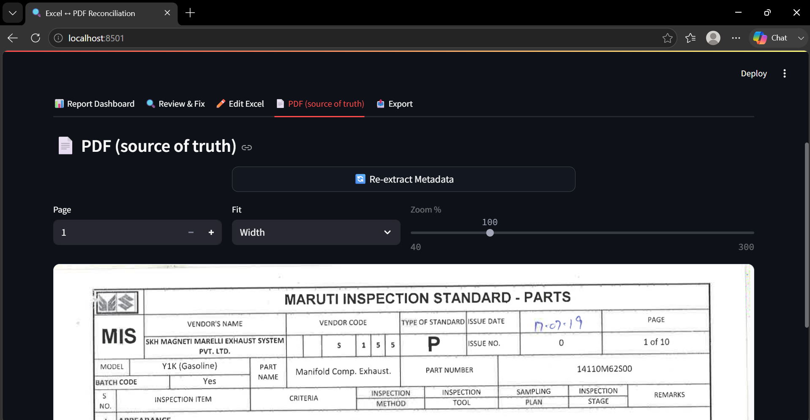
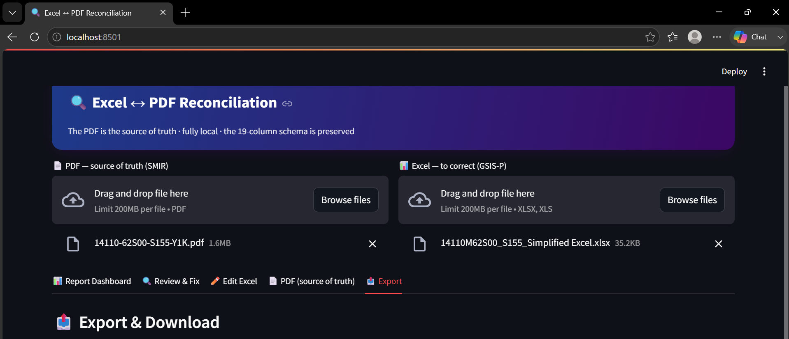

# 🖥️ UI GUIDE — Automated Inspection Standard Reconciliation (MSIL) ↔ PDF Reconciliation Tool
**Visual, step‑by‑step manual for new users.** Every screen shown and explained:
what you see → what it means → what to do.

> 📌 The **PDF (SMIR/MIS‑P)** is the source of truth. The **Excel (GSIS‑P)** is the
> human‑typed file we check and correct.

### Image index
| # | File | Screen |
|---|---|---|
| 01 | `images/01_upload.png` | Upload (empty) |
| 02 | `images/02_processing.png` | Processing |
| 03 | `images/03_dashboard.png` | Report Dashboard |
| 04 | `images/04_ready_tabs.png` | Ready + tab bar |
| 05 | `images/05_review.png` | Review & Fix |
| 06 | `images/06_edit_excel.png` | Edit Excel |
| 07 | `images/07_edit_buttons.png` | Edit Excel – action buttons |
| 08 | `images/08_edit_grid.png` | Edit Excel – editing a cell |
| 09 | `images/09_pdf_viewer.png` | PDF viewer |
| 10 | `images/10_export.png` | Export |

---

## 1. Starting the App
Open `http://localhost:8501` on the host, or `http://<host‑IP>:8501` from any team PC.

---

## 2. Screen 1 — Upload Files


| What you see | What to do |
|---|---|
| Left box **PDF — source of truth (SMIR)** | Drop the inspection PDF (or **Browse files**) |
| Right box **Excel — to correct (GSIS‑P)** | Drop the matching Excel (XLSX/XLS) |
| Blue bar *"Upload both a PDF and an Excel to begin"* | Appears until both files exist |

✅ Always upload the **matching pair** (same part/vendor).

---

## 3. Screen 2 — Processing


- File chips confirm the loaded pair (✕ removes a file).
- **"Reconciling…"** + progress bar = engine running (Preprocess → Detect → Extract → Normalize → Reconcile).
- Takes only a few seconds for digital PDFs. Do not close the tab.

---

## 4. Screen 3 — Ready + Tab Bar


When **"✅ Reconciliation ready"** appears, five tabs unlock:
**Report Dashboard · Review & Fix · Edit Excel · PDF (source of truth) · Export.**

---

## 5. Screen 4 — Report Dashboard (read first)


**KPI cards:** Match Rate `98% (252/258)` = 6 unmatched rows to review ·
Quality Score = `100 − 5×critical − 2×warning` · Critical `0` = export allowed ·
Avg. Confidence `96%` = healthy.

**Auto‑Fixes Applied:** Long Text / Issue Date / Operation No / Limits / MIC / Decimals —
already corrected automatically; no action needed.

**Column Match Analysis:** 🟩 green = Excel equals PDF · 🟥 red = difference → open
Review & Fix. Some reds are *acceptable normalizations* (model bracket, dash↔M part,
criteria re‑wording, Excel‑authority date).

---

## 6. Screen 5 — Review & Fix (working screen)


- **White columns** = your Excel (editable) · **grey 📄 columns** = PDF truth (locked).
- Controls: `📊 Show Confidence`, filters (*Rows with issues* etc.), Search, Rows/page, ◀ ▶.
- Fix = click a white cell, type the value from the grey 📄 cell.
- **Manual Alignment** (bottom): if a row's 📄 columns are empty, pick the right PDF row → ✅ Apply.

---

## 7. Screen 6 — Edit Excel


A **plain 19‑column editor** (no PDF columns) for fast, bulk typing.

### 7.1 Action buttons


| Button | What it does |
|---|---|
| 💾 **Save Changes** (red) | Commits your grid edits to the working copy and re‑validates (shows critical count). |
| 🔄 **Re‑apply Automation** | Re‑runs auto‑fixes (Long Text, dates, limits, MIC fill, decimals) after manual edits; reports cells changed. |
| ↻ **Renumber Operations** | Re‑sequences `Operation number` 1…N for rows that have inspection content. |
| 💡 *"Edit any cell, then Save."* | Reminder of the workflow. |

### 7.2 The grid & editing a cell


- Filters: **All rows / Rows with issues** + Search.
- Every column is editable. Click a cell — the **red border** marks the active cell
  (example: editing `Homologation & Customer ID`).
- Press **Enter** to confirm, then **💾 Save Changes**.

> ⚠️ There is **no PDF reference here** — use this tab for speed, but double‑check
> values in **Review & Fix** or the **PDF tab** before saving.

---

## 8. Screen 7 — PDF (source of truth)


| Control | Use |
|---|---|
| 🔄 **Re‑extract Metadata** | Re‑reads header (Vendor `S 1 5 5`→S155, Part, Model) and refreshes the session values. |
| **Page** (− / +) | Jump to any page (1…N). |
| **Fit** = Width / Custom | Width fits the window; Custom enables the zoom slider. |
| **Zoom %** (40–300) | Magnify small text (disabled when Fit=Width). |

The rendered page lets you **visually confirm any flag**. In the example the header shows
VENDOR CODE `S 1 5 5`, MODEL `Y1K (Gasoline)`, PART NUMBER `14110M62S00`, and a
**handwritten** ISSUE DATE `17.07.19` — remember the Excel date is the authority (rule BR‑02).

---

## 9. Screen 8 — Export & Download


Below the heading you get three downloads:

| Button | Content | When to use |
|---|---|---|
| ⬇ **Corrected Excel** | Your file with all fixes (keeps layout; clean sheet if original protected). | Normal delivery file. |
| ⬇ **Rebuilt‑from‑PDF** | Guaranteed 100%‑from‑PDF version. | When you want pure truth. |
| ⬇ **Diff (CSV)** | Every Excel‑vs‑PDF difference. | Audit evidence / manager review. |

- The caption shows the mode (`original‑layout` or `clean (rebuilt)`).
- Export is **blocked while 🔴 Critical > 0** — fix issues first.

---

## 10. Daily Workflow Checklist
```
1. Upload matching PDF + Excel            (01)
2. Wait for "✅ Reconciliation ready"     (02–04)
3. Dashboard: drive Critical to 0         (03)
4. Review & Fix: fix red cells; confirm blue Review rows   (05)
5. Bulk edits in Edit Excel → Save        (06–08)
6. Verify doubts in PDF viewer            (09)
7. Export Corrected + Rebuilt + Diff      (10)
```

## 11. Legend & FAQ
| Symbol | Meaning |
|---|---|
| White cell | your Excel — editable |
| Grey 📄 cell | PDF truth — locked |
| 🔴 / 🟡 / 🔵 | Critical / Warning / Review |
| Red‑border cell | currently editing |

| Question | Answer |
|---|---|
| `Y1K` vs `Y1K (Gasoline)`? | Normal — bracket dropped by rule. |
| `14110-78T00` vs `14110M78T00`? | Same part (dash↔M). |
| Issue date differs? | Excel wins — no action. |
| Extra Excel row flagged? | Not in PDF → delete it. |
| "clean (rebuilt)" on export? | Original was protected; file still correct. |
